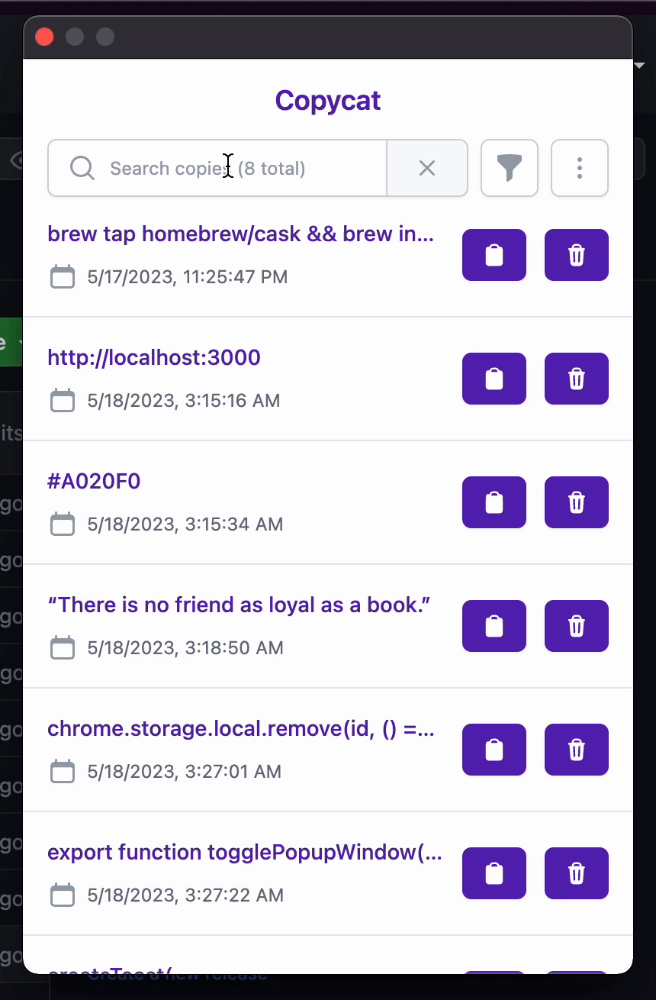
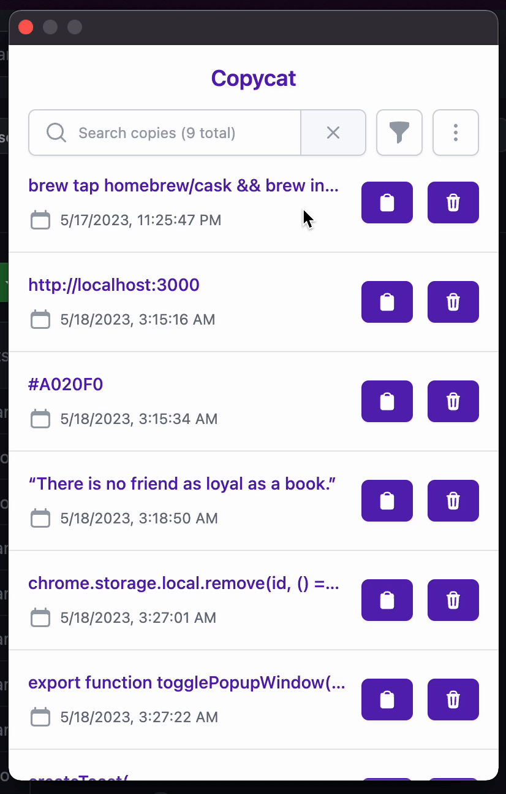
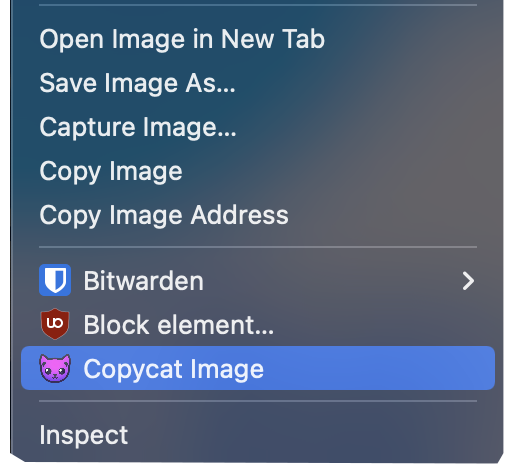

 

  
  

    Manage your clipboard history with Copycat!
     
     
    <a href="https://github.com/alDuncanson/Copycat/issues/new?assignees=alDuncanson&labels=bug&projects=&template=bug_report.md&title=">Report a Bug</a>
    ·
    <a href="https://github.com/alDuncanson/Copycat/issues/new?assignees=alDuncanson&labels=enhancement&projects=&template=feature_request.md&title=">Request Feature</a>
  

<!-- Badges -->

	
	
	
	

  

## About

Copycat saves your clipboard history so you can paste it later!

  
Table of Contents

  <ol>
    <li><a href="#about">About</a></li>
		<li><a href="#installation">Installation</a></li>
    <li><a href="#usage">Usage</a></li>
    <li><a href="#roadmap">Roadmap</a></li>
    <li><a href="#contributing">Contributing</a></li>
    <li><a href="#license">License</a></li>
    <li><a href="#contact">Contact</a></li>
    <li><a href="#acknowledgments">Acknowledgments</a></li>
  </ol>

<a href="#top">back to top</a>

## Installation

Install Copycat from the [Chrome Web Store](https://chrome.google.com/webstore/detail/copycat/gdfhhdijmhnmgpjpifkdnmajomaaceng)

<a href="#top">back to top</a>

## Usage

### Search

### Filter

### Copy again, or delete

### Copy images

Right-click an image and select "Copycat image" to save it to your clipboard history.

<a href="#top">back to top</a>

## Roadmap

- [x] Copy images
- [ ] Display copied hex codes as colors
- [ ] Clickable links
- [ ] Stylized code snippets
- [ ] Stylized quotes
- [ ] Sync clipboard history across devices

See requested features and ideas in [Copycat Discussions](https://github.com/alDuncanson/Copycat/discussions/categories/ideas)!

<a href="#top">back to top</a>

## Contributing

If you have a suggestion that would make Copycat better, you can request a feature [here](https://github.com/alDuncanson/Copycat/issues/new?assignees=alDuncanson&labels=enhancement&projects=&template=feature_request.md&title=).

Or feel free to fork the project and open a pull request with your suggested changes.

<a href="#top">back to top</a>

## License

Distributed under the MIT License. See [LICENSE](https://github.com/alDuncanson/Copycat/blob/main/LICENSE) for more information.

<a href="#top">back to top</a>

## Contact

alDuncanson@proton.me

<a href="#top">back to top</a>

## Acknowledgments

- [Shields.io](https://shields.io)
- [TailwindUI](https://tailwindui.com/)

<a href="#top">back to top</a>

